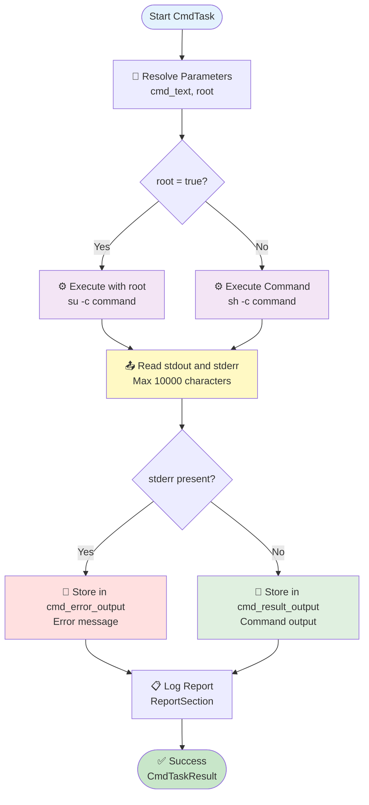

# Cmd Stage

## Summary

- **Internal name**: `Cmd Stage`
- **Category**: System  
- **Purpose**: Execute a shell command on the Android device, with optional root privilege handling.

---

## Compatibility

- **Minimum AndroMate version**: `{{ ANDROMATE_FIRST_VERSION }}`
- **Maximum AndroMate version**: `{{ ANDROMATE_CURRENT_VERSION }}`
- **Minimum Android**: `{{ ANDROMATE_MIN_APP_SDK }}`
- **Maximum Android tested**: `{{ ANDROID_CURRENT_APP_SDK }}`

- **Supported manufacturers**:
  - ✅ Samsung (One UI 6.x / 7.x / 8.x)


- **Required permissions**:
  - `INTERNET` (if the command performs network access)
  - `MANAGE_EXTERNAL_STORAGE` (if the command reads certain files on the device)
  - ⚠️ **Root required** for certain commands (depending on the value of `root`)

---

## Detailed description

The **Cmd Stage** task allows executing a *shell* command directly on the Android device.  
It is used to:

- Test network connectivity (`ping`, `curl`, `traceroute`, etc.)
- Collect system information (CPU, memory, network interfaces, radio…)
- Modify configuration (if root: `ip`, `ifconfig`, `tc`, etc.)
- Automate technical diagnostics or repetitive system actions.

The task handles:

- execution with or without **root privileges**,  
- retrieval of **standard output (stdout)**,  
- retrieval of **error output (stderr)**.

---

## Input parameters

| Parameter   | Type    | Required | Possible values             | Android Compatibility                                  | AndroMate Compatibility                                         | Default |
|-------------|---------|----------|------------------------------|----------------------------------------------------------|------------------------------------------------------------------|---------|
| `cmd_text`  | String  | Yes      | Any valid shell command      | {{ ANDROMATE_MIN_APP_SDK }} → {{ ANDROID_CURRENT_APP_SDK }} | {{ ANDROMATE_FIRST_VERSION }} → {{ ANDROMATE_CURRENT_VERSION }} | —       |
| `root`      | Boolean | No       | true / false                 | {{ ANDROMATE_MIN_APP_SDK }} → {{ ANDROID_CURRENT_APP_SDK }} | {{ ANDROMATE_FIRST_VERSION }} → {{ ANDROMATE_CURRENT_VERSION }} | false   |


---

## Outputs

| Field | Type | Trigger condition | Android Compatibility | AndroMate Compatibility | Default |
|-------|------|------------------|----------------------|-------------------------|---------|
| `cmd_result_output` | String | When the main command **succeeds** | {{ ANDROMATE_MIN_APP_SDK }} → {{ ANDROID_CURRENT_APP_SDK }} | {{ ANDROMATE_FIRST_VERSION }} → {{ ANDROMATE_CURRENT_VERSION }} | `<ANDROMATE_NULL_VALUE>` |
| `cmd_error_output` | String | When the main command **fails** | {{ ANDROMATE_MIN_APP_SDK }} → {{ ANDROID_CURRENT_APP_SDK }} | {{ ANDROMATE_FIRST_VERSION }} → {{ ANDROMATE_CURRENT_VERSION }} | `<ANDROMATE_NULL_VALUE>` |

---

---

# Flowchart



**How it works:**

1. **Resolve parameters**: Loads cmd_text and root from configuration
2. **Check root**: Determines if command should be executed with root privileges
3. **Execute command**: Runs via `/system/bin/sh -c` (or `su -c` if root=true)
4. **Read output**: Captures stdout and stderr, limited to 10,000 characters max
5. **Check for errors**: If stderr is not empty, captures error message
6. **Store result**: Stores in `cmd_result_output` (success) or `cmd_error_output` (error)
7. **Log**: Records execution report
8. **Result**: Returns CmdTaskResult (always succeeds, errors are in variables)

**Note**: This task does NOT throw exceptions. Errors are captured in `cmd_error_output` variable.

---

# Possible Error Messages

The task captures error messages from the command execution in `cmd_error_output`. These messages come from:

1. **Command execution errors** (stderr from the process)
2. **System-level errors** (process timeout, device not rooted, etc.)

## Error Message Categories

### Network Errors

| Error Message | Cause | Example Command |
|---------------|-------|-----------------|
| `Network is unreachable` | No network connectivity | `ping 8.8.8.8` |
| `Temporary failure in name resolution` | DNS resolution failure | `ping google.com` |
| `Connection refused` | Target port closed | `curl http://localhost:9999` |
| `Connection timeout` | Server not responding | `curl http://192.0.2.1` |
| `Operation timed out` | Network latency too high | `ping 8.8.8.8 -c 10` |

### File System Errors

| Error Message | Cause | Example Command |
|---------------|-------|-----------------|
| `No such file or directory` | File doesn't exist | `cat /data/nonexistent.txt` |
| `Permission denied` | Insufficient permissions | `cat /root/private.txt` (without root) |
| `Is a directory` | Trying to read directory as file | `cat /data/` |
| `Device or resource busy` | File/device locked | `rm /data/locked_file` |

### Root/Privilege Errors

| Error Message | Cause | Example Command |
|---------------|-------|-----------------|
| `Permission Denied (no rooted Device)` | root=true but device not rooted | Any command with `root: true` |
| `su: not found` | su binary not available | Root command on non-rooted device |
| `Operation not permitted` | Action requires root | `ip route add` without root |

### Command Execution Errors

| Error Message | Cause | Example Command |
|---------------|-------|-----------------|
| `command not found` | Binary/executable doesn't exist | `iperf3` (not installed) |
| `Process timed out and was killed` | Timeout exceeded (300s) | Long-running command |
| `Exec error: ...` | IOException during execution | Corrupted command or system issue |

### System Information Errors

| Error Message | Cause | Example Command |
|---------------|-------|-----------------|
| `cannot read ...` | Cannot access system file | `cat /proc/cpuinfo` (permission denied) |
| `unknown option` | Invalid command argument | `ping --invalid-option` |
| `Bad syntax` | Malformed command | `sh -c "echo unclosed` |

## Error Message Structure

Error messages in `cmd_error_output` follow this structure:

```
[Timestamp] [Error Type]: [Error Description]
Line 1 of stderr output
Line 2 of stderr output
... (up to 10,000 characters total)
```

## Handling Errors in Workflows

### Example 1: Check for network error

```json
{
  "CmdStage": [
    {
      "id": "1",
      "title": "Test Network",
      "cmd_text": "ping -c 1 8.8.8.8",
      "root": false,
      "cmd_result_output": "$PING_RESULT",
      "cmd_error_output": "$PING_ERROR"
    }
  ],
  "Condition": [
    {
      "id": "2",
      "condition": "$PING_ERROR contains 'unreachable'",
      "then": "NetworkDownTask",
      "else": "ContinueTask"
    }
  ]
}
```

### Example 2: Retry with root if permission denied

```json
{
  "CmdStage": [
    {
      "id": "1",
      "title": "First try without root",
      "cmd_text": "cat /system/build.prop",
      "root": false,
      "cmd_result_output": "$BUILD_PROP",
      "cmd_error_output": "$ERROR_1"
    }
  ],
  "Condition": [
    {
      "id": "2",
      "condition": "$ERROR_1 contains 'Permission denied'",
      "then": "RetryWithRootTask",
      "else": "SuccessTask"
    }
  ]
}
```

---

## Shell Detection

The task automatically detects if a shell is needed based on conditions:

- Command **contains spaces** (ex: `ping -c 1 8.8.8.8`)
- Command **contains special characters**: `;` `|` `&` `<` `>` `*` `(` `)` `{` `}` `[` `]`

If one of these conditions is true, the command is executed via `/system/bin/sh -c "command"`.

## Examples

| Command | Needs shell? | Reason |
|---------|--------------|--------|
| `ping` | ❌ No | No spaces, no special chars |
| `ping -c 1 8.8.8.8` | ✅ Yes | Contains spaces |
| `ping 8.8.8.8 \| grep` | ✅ Yes | Contains pipe `\|` |
| `curl http://example.com && echo ok` | ✅ Yes | Contains `&&` |
| `cat /data/file > /tmp/out` | ✅ Yes | Contains `>` (redirection) |

## Limits

| Limit | Value | Description |
|-------|-------|-------------|
| **Timeout** | 300 seconds (5 min) | Maximum time before process termination |
| **Output size** | 10,000 characters | Maximum for stdout + stderr combined |
| **Escaped characters** | `"` → `\"` | Quotes are escaped in root commands |

### Exceeding Limits

- **Timeout exceeded**: Process is killed and `CMD_PROCESS_TIMEOUT` error is raised
- **Output too large**: Text is truncated with `... output truncated ...` added at the end

---

## 1. Input parameter: `cmd_text`

The main command to execute on the device.

### Example

```json
"cmd_text: ping -c 1 www.google.com"
```

### Details

- Executed via the Android shell (`/system/bin/sh`).
- Must be compatible with the Android version and the binaries available on the device.
- Its standard output is passed to `cmd_result_output` using an AndroMate variable (e.g., `$RESULT`).

---

## 2. Input parameter: `root`

Indicates whether the command should be executed with **root** privileges.

### Example

```json
"root: true"
```

### Details

- If `root = true`, the command is usually executed via `su -c "<cmd_text>"`.
- If the device is not rooted or `su` is unavailable, the task may fail.
- Use only for actions requiring elevated permissions (low-level networking, system files, etc.).

---

# Output details

## 3. Result variable: `cmd_error_output`

`cmd_error_output` is an **internal variable** used to **store the error output (stderr)** produced by the main command (`cmd_text`) when it fails.

### Example

```json
"cmd_error_output: $CMD_ERROR"
```

### Trigger

`cmd_error_output` is filled when the main command:

- returns an **exit code ≠ 0**,  
- exceeds a **timeout**,  
- or when the command is **not found or not executable**.

In all these cases, the error output (stderr) is copied into the variable.

### Use cases

- Save the error generated by a command (`ping`, `iperf`, `twamp`, `curl`…)
- Record specific logs (`logcat`, internal traces…)
- Send the error to a backend for analysis or monitoring
- Use the error in another task (condition, fallback, report…)

---

## 4. Result variable: `cmd_result_output`

`cmd_result_output` is an **internal variable** used to **store the standard output (stdout)** produced by the command executed in the task.

### Example

```json
"cmd_result_output: $RESULT"
```

### Details

- `$RESULT` contains **the standard output of the main command**.
- The workflow can:
  - analyze the output,  
  - extract a value (response time, code, state…),  
  - transform or normalize the result,  
  - send it to a backend (via `curl` or `Http request`).

### Use cases

- Send metrics to a collection server
- Chain the execution of multiple dependent commands

---

## Complete JSON example

```json
{
  "CmdStage": [
    {
      "id": "-1",
      "title": "Cmd Stage",
      "cmd_text": "ping -c 1 www.google.com",
      "root": true,
      "cmd_error_output": "$PING_GOOGLE_CMD_ERROR",
      "cmd_result_output": "$PING_GOOGLE_CMD_RESULT"
    }
  ]
}
```
