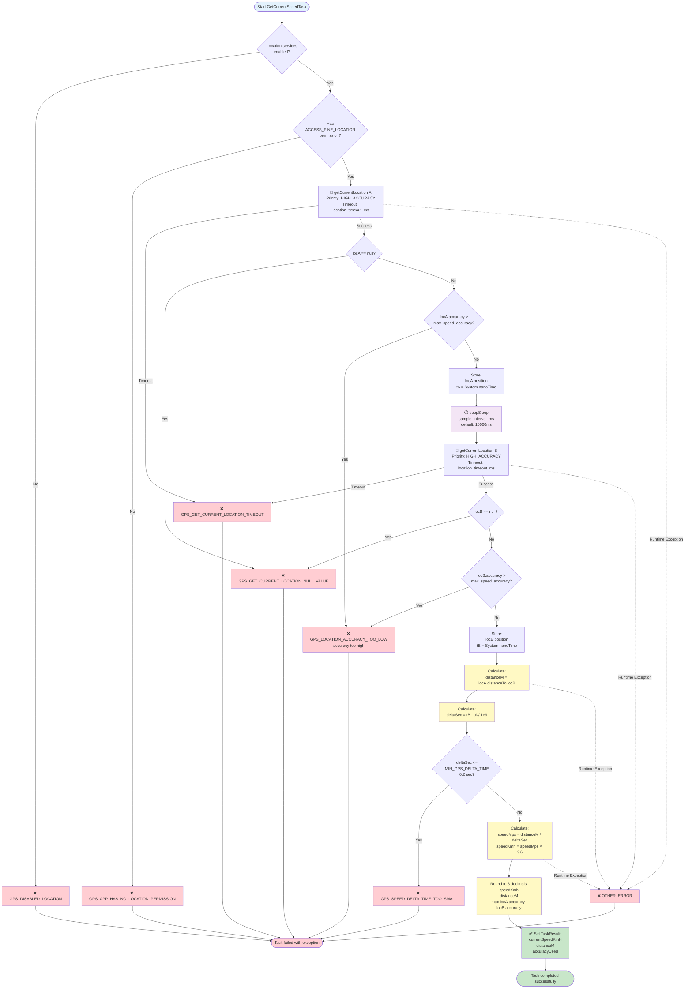

# Current Speed Stage

## Summary

-   **Internal name**: `Current Speed`
-   **Category**: Location
-   **Purpose**: Measure the device's current speed using GPS updates,
    with configurable sampling, timeout, and accuracy filtering.

------------------------------------------------------------------------

## Compatibility

-   **Minimum AndroMate version**: `{{ ANDROMATE_FIRST_VERSION }}`

-   **Maximum AndroMate version**: `{{ ANDROMATE_CURRENT_VERSION }}`

-   **Minimum Android**: `{{ ANDROMATE_MIN_APP_SDK }}`

-   **Maximum Android tested**: `{{ ANDROID_CURRENT_APP_SDK }}`

-   **Supported manufacturers**:

    -   ✅ All manufacturers (tested on Samsung One UI 6.x / 7.x / 8.x and Google Pixel Android Stock)

-   **Required permissions**:

    -   `ACCESS_FINE_LOCATION`
    -   `ACCESS_COARSE_LOCATION`
    -   `ACCESS_BACKGROUND_LOCATION` (if used in background)
    -   Location services must be enabled on the device

------------------------------------------------------------------------

## Detailed description

The **Current Speed Stage** task calculates the device's movement speed
based on GPS location updates.

It is used to:

-   Measure real-time speed (km/h)
-   Track movement over time
-   Compute traveled distance
-   Filter speed measurements based on GPS accuracy
-   Attach speed metrics to telemetry or monitoring reports

The task handles:

-   configurable GPS timeout handling,
-   configurable sampling interval,
-   maximum allowed speed accuracy filtering,
-   calculation of speed value in km/h,
-   calculation of traveled distance in meters.

------------------------------------------------------------------------

## Flowchart

The following diagram illustrates the actual implementation based on Android code:



**How it works:**

1. **Initial checks**: Verifies location services are enabled and app has location permissions
2. **First GPS sample**: Gets initial position with high accuracy priority
3. **Accuracy validation**: Ensures GPS accuracy is acceptable (≤ max threshold)
4. **Wait period**: Pauses for the configured sampling interval (default 10 seconds)
5. **Second GPS sample**: Gets new position with same accuracy priority
6. **Distance calculation**: Measures distance traveled between the two positions
7. **Time calculation**: Calculates elapsed time between samples
8. **Delta validation**: Ensures enough time passed (≥ 0.2 seconds) for reliable calculation
9. **Speed calculation**: Computes speed in km/h from distance and time
10. **Results**: Returns speed, distance, and accuracy (rounded to 3 decimals)

**Legend:**
- 🔵 **Blue**: Start
- 🟢 **Green**: Success
- 🔴 **Red**: Exceptions
- 🟡 **Yellow**: Calculations
- 🟣 **Purple**: Time delay
- **Dotted lines**: Runtime exceptions

------------------------------------------------------------------------

## Input parameters

| Parameter | Type | Required | Possible values | Android Compatibility | AndroMate Compatibility | Default |
|-----------|------|----------|-----------------|----------------------|-------------------------|---------|
| `location_timeout` | Integer | Yes | Time in milliseconds | {{ ANDROMATE_MIN_APP_SDK }} → {{ ANDROID_CURRENT_APP_SDK }} | {{ ANDROMATE_FIRST_VERSION }} → {{ ANDROMATE_CURRENT_VERSION }} | 20000 |
| `sample_interval` | Integer | Yes | Time in milliseconds | {{ ANDROMATE_MIN_APP_SDK }} → {{ ANDROID_CURRENT_APP_SDK }} | {{ ANDROMATE_FIRST_VERSION }} → {{ ANDROMATE_CURRENT_VERSION }} | 1000 |
| `max_speed_accuracy` | Float | Yes | Accuracy in meters | {{ ANDROMATE_MIN_APP_SDK }} → {{ ANDROID_CURRENT_APP_SDK }} | {{ ANDROMATE_FIRST_VERSION }} → {{ ANDROMATE_CURRENT_VERSION }} | 5.0 |

------------------------------------------------------------------------

## Outputs

| Field | Type | Trigger condition | Android Compatibility | AndroMate Compatibility | Default |
|-------|------|------------------|----------------------|-------------------------|---------|
| `speed_value_output` | Double | When calculation is successful | {{ ANDROMATE_MIN_APP_SDK }} → {{ ANDROID_CURRENT_APP_SDK }} | {{ ANDROMATE_FIRST_VERSION }} → {{ ANDROMATE_CURRENT_VERSION }} | `<ANDROMATE_NULL_VALUE>` |
| `distance_output` | Double | When calculation is successful | {{ ANDROMATE_MIN_APP_SDK }} → {{ ANDROID_CURRENT_APP_SDK }} | {{ ANDROMATE_FIRST_VERSION }} → {{ ANDROMATE_CURRENT_VERSION }} | `<ANDROMATE_NULL_VALUE>` |
| `speed_accuracy_used` | Float | When calculation is successful | {{ ANDROMATE_MIN_APP_SDK }} → {{ ANDROID_CURRENT_APP_SDK }} | {{ ANDROMATE_FIRST_VERSION }} → {{ ANDROMATE_CURRENT_VERSION }} | `<ANDROMATE_NULL_VALUE>` |

------------------------------------------------------------------------

## Exceptions

| Code | Exception Name | Description |
|------|---------------|-------------|
| GPS_DISABLED_LOCATION | GPS Disabled | Location services are disabled on the device. Enable GPS in device settings. |
| GPS_APP_HAS_NO_LOCATION_PERMISSION | Missing Location Permission | The app does not have ACCESS_FINE_LOCATION permission. Grant location permissions to AndroMate. |
| GPS_GET_CURRENT_LOCATION_NULL_VALUE | GPS Position Null | Unable to obtain GPS position. The GPS provider returned a null location. |
| GPS_LOCATION_ACCURACY_TOO_LOW | Insufficient GPS Accuracy | GPS accuracy exceeds the maximum threshold (max_speed_accuracy). Current accuracy is too low for reliable speed measurement. |
| GPS_SPEED_DELTA_TIME_TOO_SMALL | Time Delta Too Small | Time difference between two GPS samples is too small (< 0.2s). Cannot calculate reliable speed. |
| GPS_GET_CURRENT_LOCATION_TIMEOUT | GPS Timeout | Failed to obtain GPS position within the specified timeout period (location_timeout). |
| OTHER_ERROR | Unexpected Error | An unexpected runtime error occurred during execution. Check logs for details. |

------------------------------------------------------------------------

# Parameter details

## 1. Input parameter: `location_timeout`

Defines the maximum time (in milliseconds) to wait for valid GPS
updates.

### Example

``` json
"location_timeout": 20000
```

### Details

-   If no valid GPS data is received within this period, the task fails.

------------------------------------------------------------------------

## 2. Input parameter: `sample_interval`

Defines the interval (in milliseconds) between two GPS samples used for
speed calculation.

### Example

``` json
"sample_interval": 1000
```

### Details

-   Lower values provide more precise tracking but increase battery
    consumption.
-   Recommended range: 500 -- 2000 ms.

------------------------------------------------------------------------

## 3. Input parameter: `max_speed_accuracy`

Defines the maximum allowed GPS speed accuracy threshold.

### Example

``` json
"max_speed_accuracy": 5.0
```

### Details

-   If the reported GPS accuracy exceeds this threshold, the sample is
    ignored.
-   Ensures more reliable speed measurements.

------------------------------------------------------------------------

# Output details

## 4. Result variable: `speed_value_output`

Stores the calculated speed value in **km/h**.

### Example

``` json
"speed_value_output": "$SPEED_KMH"
```

------------------------------------------------------------------------

## 5. Result variable: `distance_output`

Stores the total traveled distance in **meters (m)**.

### Example

``` json
"distance_output": "$DISTANCE_M"
```

------------------------------------------------------------------------

## 6. Result variable: `speed_accuracy_used`

Stores the GPS accuracy value (converted/used) associated with the speed
calculation (km/h equivalent context).

### Example

``` json
"speed_accuracy_used": "$SPEED_ACCURACY"
```

### Details

-   **Note**: The accuracy value represents the margin of error. For example, if the calculated speed is 50 km/h with an accuracy of 5 km/h, the actual speed is **50 ± 5 km/h** with a probability of approximately **68%**.

------------------------------------------------------------------------

## Complete JSON example

``` json
{
  "Current Speed": [
    {
      "category": "Current Speed",
      "text": "Current Speed",
      "visible": true,
      "description": "This task will ask phone GPS to get your current speed (Km/h)",
      "key": -1,
      "loc": "-400 40"
    }
  ]
}
```
