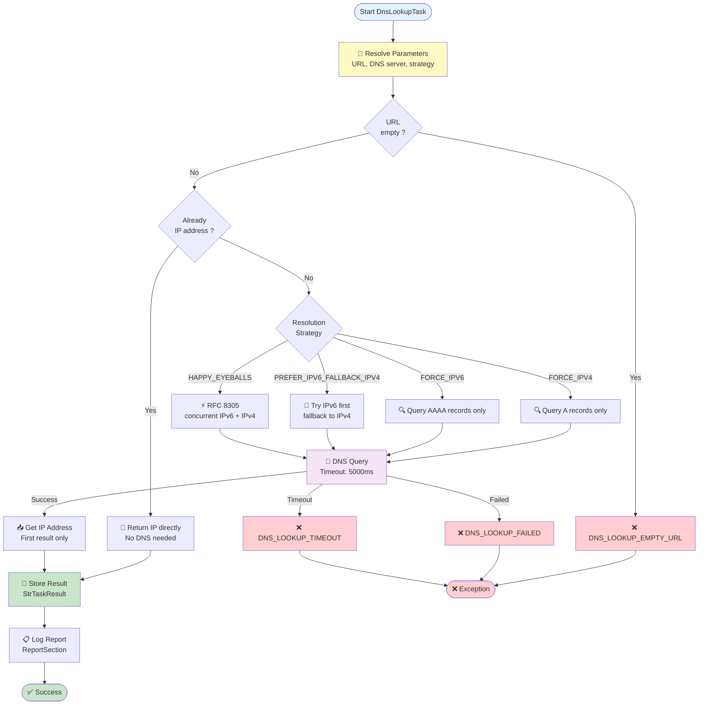
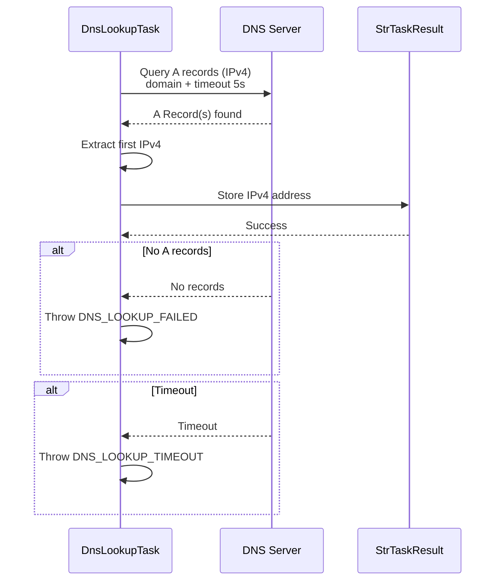
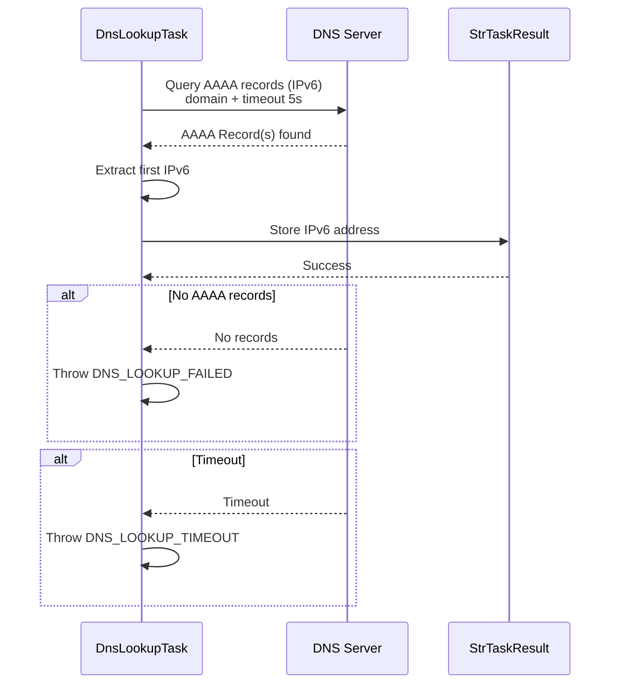
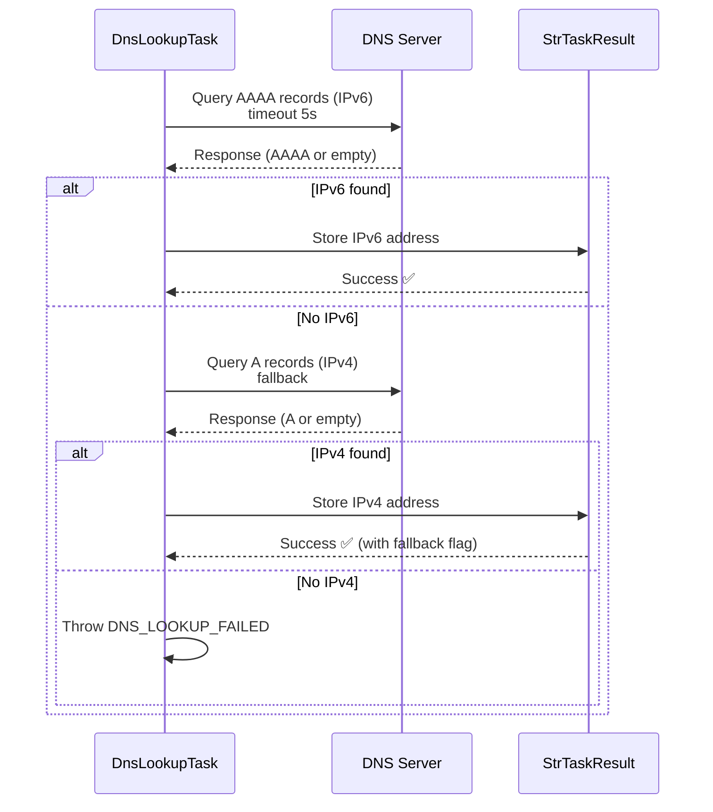
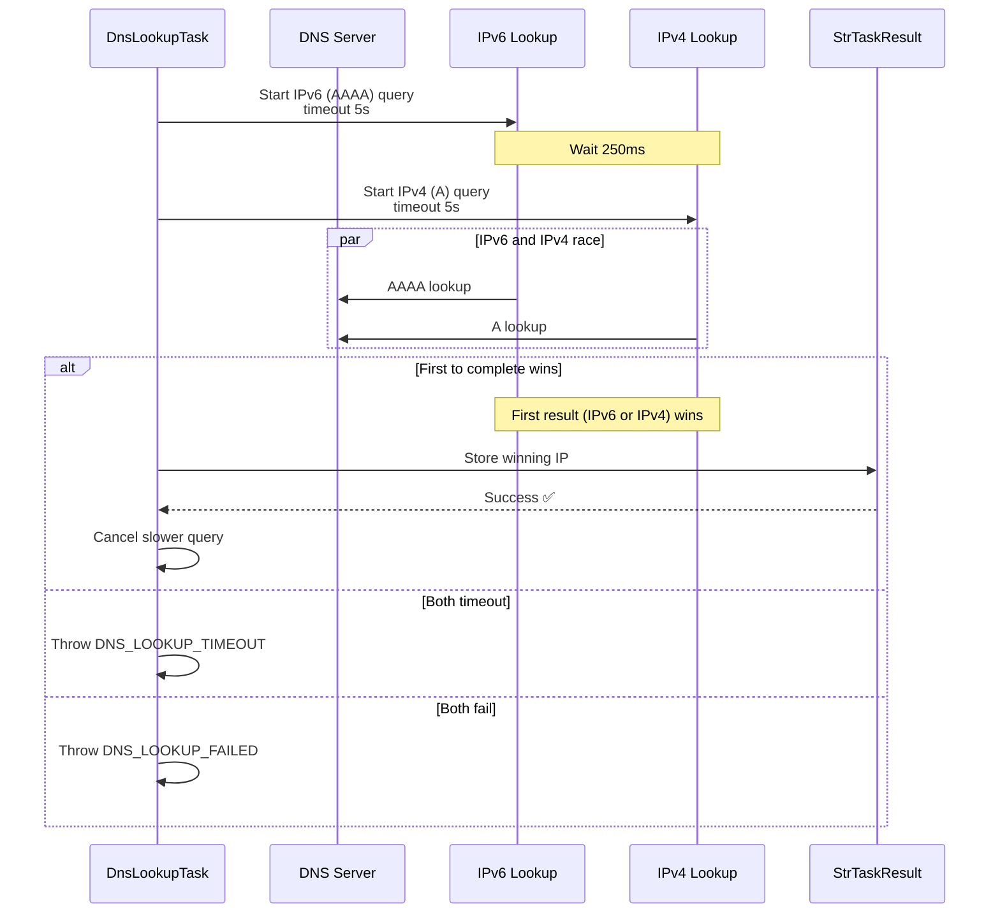

# DNS Lookup Stage

## Summary

-   **Internal name**: `DnsLookup`
-   **Category**: Communication
-   **Purpose**: Resolve a domain name to an IP address using configurable DNS resolution strategies (IPv4 only, IPv6 only, IPv6 with IPv4 fallback, or Happy Eyeballs).

------------------------------------------------------------------------

## Compatibility

-   **Minimum AndroMate version**: `{{ ANDROMATE_FIRST_VERSION }}`

-   **Maximum AndroMate version**: `{{ ANDROMATE_CURRENT_VERSION }}`

-   **Minimum Android**: `{{ ANDROMATE_MIN_APP_SDK }}`

-   **Maximum Android tested**: `{{ ANDROID_CURRENT_APP_SDK }}`

-   **Required permissions**:

    -   `INTERNET`
    -   `ACCESS_NETWORK_STATE`

------------------------------------------------------------------------

# Input parameters

| Parameter | Type | Required | Possible values | Android Compatibility | AndroMate Compatibility | Default |
|-----------|------|----------|-----------------|----------------------|-------------------------|---------|
| `url` | String | Yes | Valid domain or IP | {{ ANDROMATE_MIN_APP_SDK }} → {{ ANDROID_CURRENT_APP_SDK }} | {{ ANDROMATE_FIRST_VERSION }} → {{ ANDROMATE_CURRENT_VERSION }} | — |
| `dns_server` | String | No | Valid DNS server IP | {{ ANDROMATE_MIN_APP_SDK }} → {{ ANDROID_CURRENT_APP_SDK }} | {{ ANDROMATE_FIRST_VERSION }} → {{ ANDROMATE_CURRENT_VERSION }} | 8.8.8.8 (Google DNS) |
| `resolve_ops` | String | Yes | FORCE_IPV4, FORCE_IPV6, PREFER_IPV6_FALLBACK_IPV4, HAPPY_EYEBALLS | {{ ANDROMATE_MIN_APP_SDK }} → {{ ANDROID_CURRENT_APP_SDK }} | {{ ANDROMATE_FIRST_VERSION }} → {{ ANDROMATE_CURRENT_VERSION }} | PREFER_IPV6_FALLBACK_IPV4 |

------------------------------------------------------------------------

# Output parameters

| Field | Type | Trigger condition | Android Compatibility | AndroMate Compatibility | Default |
|-------|------|------------------|----------------------|-------------------------|---------|
| `dns_result_output` | String | When DNS resolution succeeds | {{ ANDROMATE_MIN_APP_SDK }} → {{ ANDROID_CURRENT_APP_SDK }} | {{ ANDROMATE_FIRST_VERSION }} → {{ ANDROMATE_CURRENT_VERSION }} | `<ANDROMATE_NULL_VALUE>` |

------------------------------------------------------------------------

## Exceptions

| Code | Exception Name | Description |
|------|---------------|-------------|
| DNS_LOOKUP_EMPTY_URL | Empty URL | The domain/URL field is empty or null. |
| DNS_LOOKUP_FAILED | DNS Resolution Failed | DNS lookup failed for the given domain (no A/AAAA records found or DNS server error). |
| DNS_LOOKUP_TIMEOUT | DNS Timeout | DNS resolution exceeded the 5-second timeout. |
| DNS_LOOKUP_INVALID_STRATEGY | Invalid Strategy | The specified resolution strategy is not recognized. |

------------------------------------------------------------------------

# Flowchart

The following diagram illustrates the overall implementation based on Android code:



**How it works:**

1. **Resolve parameters**: Resolves dynamic variables in URL and DNS server
2. **Validate URL**: Checks that URL is not empty
3. **Check if already IP**: If the input is already an IP address, return it directly without DNS query
4. **Select resolution strategy**: Chooses between FORCE_IPV4, FORCE_IPV6, PREFER_IPV6_FALLBACK_IPV4, or HAPPY_EYEBALLS
5. **DNS Query**: Performs DNS lookup with 5-second timeout
6. **Get IP Address**: Extracts the first IP from results
7. **Store result**: Saves the resolved IP in StrTaskResult
8. **Log report**: Records execution report
9. **Result**: Returns success or exception

------------------------------------------------------------------------

# DNS Resolution Strategies

## Strategy 1: FORCE_IPV4



**Use case**: Force resolution to IPv4 only (legacy systems).

---

## Strategy 2: FORCE_IPV6



**Use case**: Force resolution to IPv6 only (modern IPv6-only networks).

---

## Strategy 3: PREFER_IPV6_FALLBACK_IPV4



**Use case**: Prefer modern IPv6 but fallback to IPv4 if unavailable.

---

## Strategy 4: HAPPY_EYEBALLS (RFC 8305)



**Use case**: Fastest resolution with intelligent fallback (RFC 8305 standard).

---

## Strategy Comparison

| Strategy | IPv4 | IPv6 | Speed | Use Case |
|----------|------|------|-------|----------|
| **FORCE_IPV4** | ✅ | ❌ | Fast | Legacy systems |
| **FORCE_IPV6** | ❌ | ✅ | Fast | IPv6-only networks |
| **PREFER_IPV6_FALLBACK_IPV4** | ✅ (fallback) | ✅ (preferred) | Medium | Balanced modern networks |
| **HAPPY_EYEBALLS** | ✅ | ✅ | Very Fast | Optimized (RFC 8305) |

------------------------------------------------------------------------

# Parameter details

## 1. Input parameter: `url`

Domain name or IP address to resolve.

### Example

``` json
"url": "api.example.com"
```

------------------------------------------------------------------------

## 2. Input parameter: `dns_server`

Custom DNS server to use for resolution.

### Default value

`8.8.8.8` (Google DNS)

### Possible values

- `8.8.8.8` (Google)
- `1.1.1.1` (Cloudflare)
- `208.67.222.222` (OpenDNS)
- Custom DNS server IP

### Example

``` json
"dns_server": "1.1.1.1"
```

------------------------------------------------------------------------

## 3. Input parameter: `resolve_ops`

Resolution strategy to use.

### Possible values

- `FORCE_IPV4`: Query A records only
- `FORCE_IPV6`: Query AAAA records only
- `PREFER_IPV6_FALLBACK_IPV4`: Try IPv6 first, fallback to IPv4
- `HAPPY_EYEBALLS`: RFC 8305 concurrent resolution

### Default value

`PREFER_IPV6_FALLBACK_IPV4`

### Example

``` json
"resolve_ops": "HAPPY_EYEBALLS"
```

------------------------------------------------------------------------

# Output details

## 1. Result variable: `dns_result_output`

Contains the resolved IP address (IPv4 or IPv6).

### Example

``` json
"dns_result_output": "$DNS_IP"
```

------------------------------------------------------------------------

# Complete JSON example

``` json
{
  "DnsLookup": [
    {
      "id": "-1",
      "title": "DNS Lookup Stage",
      "url": "api.example.com",
      "dns_server": "8.8.8.8",
      "resolve_ops": "HAPPY_EYEBALLS",
      "dns_result_output": "$RESOLVED_IP"
    }
  ]
}
```

------------------------------------------------------------------------

# Notes

-   **Timeout**: All DNS queries have a fixed 5-second timeout.
-   **Already IP**: If the input is already an IP address (IPv4 or IPv6), no DNS query is performed and the address is returned immediately.
-   **Happy Eyeballs**: Implements RFC 8305 with 250ms stagger between IPv6 and IPv4 queries for optimal performance.
-   **DNS Server**: If not specified, the system default DNS server is used (usually from device settings).

------------------------------------------------------------------------

# IP Address Verification

AndroMate uses the following regex patterns to check if the URL is already a valid IP address:

## IPv4 Regex

```regex
^(25[0-5]|2[0-4]\d|1\d\d|[1-9]?\d)(\.(25[0-5]|2[0-4]\d|1\d\d|[1-9]?\d)){3}$
```

## IPv6 Regex

```regex
^(([0-9a-fA-F]{1,4}:){7}[0-9a-fA-F]{1,4}|([0-9a-fA-F]{1,4}:){1,7}:|([0-9a-fA-F]{1,4}:){1,6}:[0-9a-fA-F]{1,4}|([0-9a-fA-F]{1,4}:){1,5}(:[0-9a-fA-F]{1,4}){1,2}|([0-9a-fA-F]{1,4}:){1,4}(:[0-9a-fA-F]{1,4}){1,3}|([0-9a-fA-F]{1,4}:){1,3}(:[0-9a-fA-F]{1,4}){1,4}|([0-9a-fA-F]{1,4}:){1,2}(:[0-9a-fA-F]{1,4}){1,5}|[0-9a-fA-F]{1,4}:((:[0-9a-fA-F]{1,4}){1,6})|:((:[0-9a-fA-F]{1,4}){1,7}|:))$
```

If the URL matches one of these regex patterns, no DNS query is performed and the IP address is returned directly.


