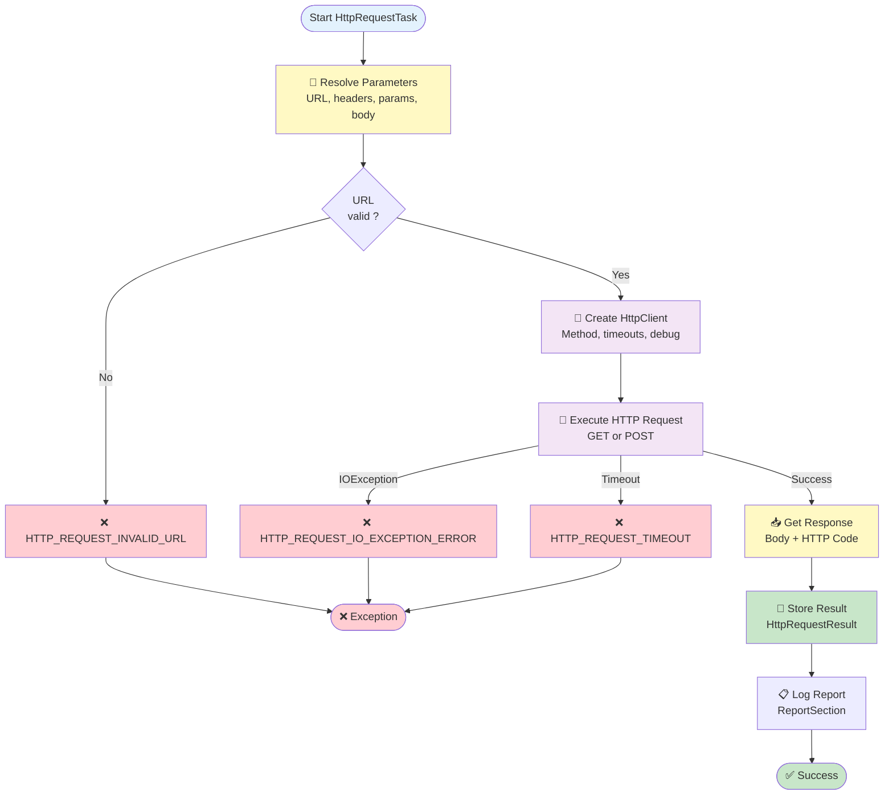

# Http Request Stage

## Summary

-   **Internal name**: `HttpRequest`
-   **Category**: Communication
-   **Purpose**: Perform an HTTP request (GET or POST) with configurable
    parameters, headers, timeouts, and optional JSON body.

------------------------------------------------------------------------

## Compatibility

-   **Minimum AndroMate version**: `{{ ANDROMATE_FIRST_VERSION }}`

-   **Maximum AndroMate version**: `{{ ANDROMATE_CURRENT_VERSION }}`

-   **Minimum Android**: `{{ ANDROMATE_MIN_APP_SDK }}`

-   **Maximum Android tested**: `{{ ANDROID_CURRENT_APP_SDK }}`

-   **Required permissions**:

    -   `INTERNET`
    -   `ACCESS_NETWORK_STATE`

------------------------------------------------------------------------

# Input parameters

| Parameter | Type | Required | Possible values | Android Compatibility | AndroMate Compatibility | Default |
|-----------|------|----------|-----------------|----------------------|-------------------------|---------|
| `url` | String | Yes | Valid URL | {{ ANDROMATE_MIN_APP_SDK }} → {{ ANDROID_CURRENT_APP_SDK }} | {{ ANDROMATE_FIRST_VERSION }} → {{ ANDROMATE_CURRENT_VERSION }} | — |
| `method` | String | Yes | GET, POST | {{ ANDROMATE_MIN_APP_SDK }} → {{ ANDROID_CURRENT_APP_SDK }} | {{ ANDROMATE_FIRST_VERSION }} → {{ ANDROMATE_CURRENT_VERSION }} | GET |
| `connection_timeout` | Integer | No | Time in milliseconds | {{ ANDROMATE_MIN_APP_SDK }} → {{ ANDROID_CURRENT_APP_SDK }} | {{ ANDROMATE_FIRST_VERSION }} → {{ ANDROMATE_CURRENT_VERSION }} | 10000 |
| `read_timeout` | Integer | No | Time in milliseconds | {{ ANDROMATE_MIN_APP_SDK }} → {{ ANDROID_CURRENT_APP_SDK }} | {{ ANDROMATE_FIRST_VERSION }} → {{ ANDROMATE_CURRENT_VERSION }} | 10000 |
| `http_debug` | Boolean | No | true / false | {{ ANDROMATE_MIN_APP_SDK }} → {{ ANDROID_CURRENT_APP_SDK }} | {{ ANDROMATE_FIRST_VERSION }} → {{ ANDROMATE_CURRENT_VERSION }} | false |
| `request_body_json` | String | No | Valid JSON string | {{ ANDROMATE_MIN_APP_SDK }} → {{ ANDROID_CURRENT_APP_SDK }} | {{ ANDROMATE_FIRST_VERSION }} → {{ ANDROMATE_CURRENT_VERSION }} | — |
| `parameters` | List | No | List of parameters | {{ ANDROMATE_MIN_APP_SDK }} → {{ ANDROID_CURRENT_APP_SDK }} | {{ ANDROMATE_FIRST_VERSION }} → {{ ANDROMATE_CURRENT_VERSION }} | [] |
| `headers` | List | No | List of headers | {{ ANDROMATE_MIN_APP_SDK }} → {{ ANDROID_CURRENT_APP_SDK }} | {{ ANDROMATE_FIRST_VERSION }} → {{ ANDROMATE_CURRENT_VERSION }} | [] |

------------------------------------------------------------------------

# Output parameters

| Field | Type | Trigger condition | Android Compatibility | AndroMate Compatibility | Default |
|-------|------|------------------|----------------------|-------------------------|---------|
| `http_response_output` | String | When request succeeds | {{ ANDROMATE_MIN_APP_SDK }} → {{ ANDROID_CURRENT_APP_SDK }} | {{ ANDROMATE_FIRST_VERSION }} → {{ ANDROMATE_CURRENT_VERSION }} | `<ANDROMATE_NULL_VALUE>` |
| `http_error_output` | String | When request fails | {{ ANDROMATE_MIN_APP_SDK }} → {{ ANDROID_CURRENT_APP_SDK }} | {{ ANDROMATE_FIRST_VERSION }} → {{ ANDROMATE_CURRENT_VERSION }} | `<ANDROMATE_NULL_VALUE>` |
| `http_status_code` | Integer | Always | {{ ANDROMATE_MIN_APP_SDK }} → {{ ANDROID_CURRENT_APP_SDK }} | {{ ANDROMATE_FIRST_VERSION }} → {{ ANDROMATE_CURRENT_VERSION }} | -1 |

------------------------------------------------------------------------

## Exceptions

| Code | Exception Name | Description |
|------|---------------|-------------|
| HTTP_REQUEST_IO_EXCEPTION_ERROR | HTTP I/O Error | Connection or server access error (IOException). |
| HTTP_REQUEST_INVALID_URL | Invalid URL | The provided URL is invalid or empty. |
| HTTP_REQUEST_TIMEOUT | HTTP Timeout | Connection or read timeout exceeded. |

------------------------------------------------------------------------

# Flowchart

The following diagram illustrates the actual implementation based on Android code:



**How it works:**

1. **Resolve parameters**: Resolves dynamic variables in URL, headers, parameters and body
2. **Validate URL**: Checks that URL is valid and not empty
3. **Create HTTP client**: Initializes HttpClient with parameters (timeouts, method, debug)
4. **Execute request**: Sends HTTP request (GET or POST)
5. **Get response**: Retrieves response body and HTTP status code
6. **Store result**: Saves results in HttpRequestResult
7. **Log report**: Records execution report
8. **Result**: Returns success or exception

------------------------------------------------------------------------

# Parameter details

## 1. Input parameter: `url`

Target endpoint URL.

### Example

``` json
"url": "https://api.example.com/monitoring"
```

------------------------------------------------------------------------

## 2. Input parameter: `method`

HTTP method used for the request.

### Default value

`GET`

### Possible values

`GET`, `POST`

### Example

``` json
"method": "POST"
```

------------------------------------------------------------------------

## 3. Input parameter: `connection_timeout`

Maximum time (ms) to establish connection.

### Default value

`10000`

------------------------------------------------------------------------

## 4. Input parameter: `read_timeout`

Maximum time (ms) to wait for server response.

### Default value

`10000`

------------------------------------------------------------------------

## 5. Input parameter: `http_debug`

Enable verbose HTTP logging.

### Default value

`false`

------------------------------------------------------------------------

## 6. Input parameter: `request_body_json`

Optional JSON body (used mainly with POST).

### Example

``` json
"request_body_json": "{ \"deviceId\": \"$DEVICE_ID\" }"
```

------------------------------------------------------------------------

## 7. Input parameter: `parameters`

List of query parameters.

### Example

``` json
"parameters": [
  { "param_name": "deviceId", "value": "$DEVICE_ID" }
]
```

------------------------------------------------------------------------

## 8. Input parameter: `headers`

List of HTTP headers.

### Example

``` json
"headers": [
  { "param_name": "Authorization", "value": "Bearer $TOKEN" }
]
```

------------------------------------------------------------------------

# Output details

## 1. Result variable: `http_error_output`

Contains error output when request fails.

## 2. Result variable: `http_response_output`

Contains response body when request succeeds.

## 3. Result variable: `http_status_code`

Contains HTTP status code returned by server.

------------------------------------------------------------------------

# Complete JSON example

``` json
{
  "HttpRequest": [
    {
      "id": "-1",
      "title": "Http Request Stage",
      "url": "https://api.example.com/monitoring",
      "method": "POST",
      "connection_timeout": 5000,
      "read_timeout": 10000,
      "http_debug": true,
      "request_body_json": "{ \"deviceId\": \"$DEVICE_ID\" }",
      "parameters": [
        { "param_name": "deviceId", "value": "$DEVICE_ID" }
      ],
      "headers": [
        { "param_name": "Authorization", "value": "Bearer $TOKEN" }
      ],
      "http_error_output": "$HTTP_ERROR",
      "http_response_output": "$HTTP_RESULT",
      "http_status_code": "$HTTP_STATUS"
    }
  ]
}
```
