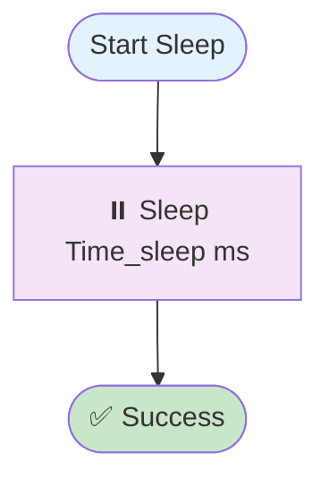

# Sleep

## Summary

- **Internal name**: `SLEEP`
- **Category**: Time  
- **Purpose**: Pause the workflow execution for a specified duration.

---

## Compatibility

- **Minimum AndroMate version**: `{{ ANDROMATE_FIRST_VERSION }}`
- **Maximum AndroMate version**: `{{ ANDROMATE_CURRENT_VERSION }}`
- **Minimum Android version**: `{{ ANDROMATE_MIN_APP_SDK }}`
- **Maximum Android version tested**: `{{ ANDROID_CURRENT_APP_SDK }}`

- **Supported manufacturers**:
  - ✅ All manufacturers (tested on Samsung One UI 6.x / 7.x / 8.x and Google Pixel Android Stock)

- **Required permissions**:
  - None

---

## Detailed description

The **Sleep** task temporarily pauses the workflow execution.  
It is used to:

- Add delays between two automated actions.
- Wait for a screen to stabilize before performing the next action (click, swipe…).
- Synchronize network or system actions (e.g., wait for SIM, Wi-Fi, or network state change).
- Create controlled pauses in benchmarking, QoS, or TV scenarios.

### Known limitations

- Very long durations may unnecessarily extend the total workflow execution time.
- Does not guarantee that the system state is stable when the pause ends; it is only a fixed delay.

---

## Input parameters

| Parameter | Type | Required | Possible values | Android Compatibility | AndroMate Compatibility | Default |
|-----------|------|----------|-----------------|----------------------|-------------------------|---------|
| `Time_sleep` | Integer | Yes | > 0 (milliseconds) | {{ ANDROMATE_MIN_APP_SDK }} → {{ ANDROID_CURRENT_APP_SDK }} | {{ ANDROMATE_FIRST_VERSION }} → {{ ANDROMATE_CURRENT_VERSION }} | 500 |

---

# Flowchart



**Note**: This task does not throw any exceptions.

---

## Full JSON example

```json
{
  "Sleep": [
    {
      "id": "-1",
      "title": "Sleep",
      "Time_sleep": 500
    }
  ]
}
```
