# Runtime Resolver

## Introduction

The **Runtime Resolver** is the core engine of the Workflow Runtime that processes variables during workflow execution. It manages the lifecycle of variables by registering outputs, resolving parameters, and casting types.

---

## Execution Flow Overview

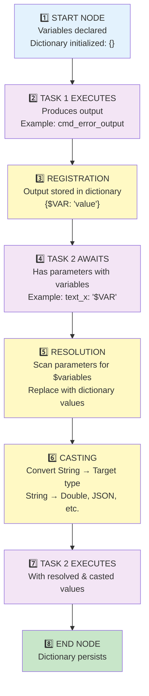

---

## Stage 1: Variable Declaration and Dictionary Initialization

At the START node, variables are **declared and the runtime dictionary is initialized**.

```json
{
  "Start": [
    {
      "id": "0",
      "variables": [
        {
          "variableName": "$TIME_OFFSET",
          "variableValue": "0",
          "is_kpi": false
        },
        {
          "variableName": "$LATITUDE",
          "variableValue": "0.0",
          "is_kpi": true
        },
        {
          "variableName": "$API_RESPONSE",
          "variableValue": "{}",
          "is_kpi": false
        }
      ]
    }
  ]
}
```

**Initial Runtime Dictionary:**
```
{
  "$TIME_OFFSET": "0",
  "$LATITUDE": "0.0",
  "$API_RESPONSE": "{}"
}
```

---

## Stage 2: Task Execution and Output Registration

When a task executes and produces output, the **Runtime Resolver registers** that output in the dictionary.

### Example: NtpSync Task

```json
{
  "NtpSync": [
    {
      "id": "1",
      "ntp_server": "time.google.com",
      "ntp_port": 123,
      "ntp_timeout": 5000,
      "ntp_offset_output": "$TIME_OFFSET"
    }
  ]
}
```

### Execution Timeline

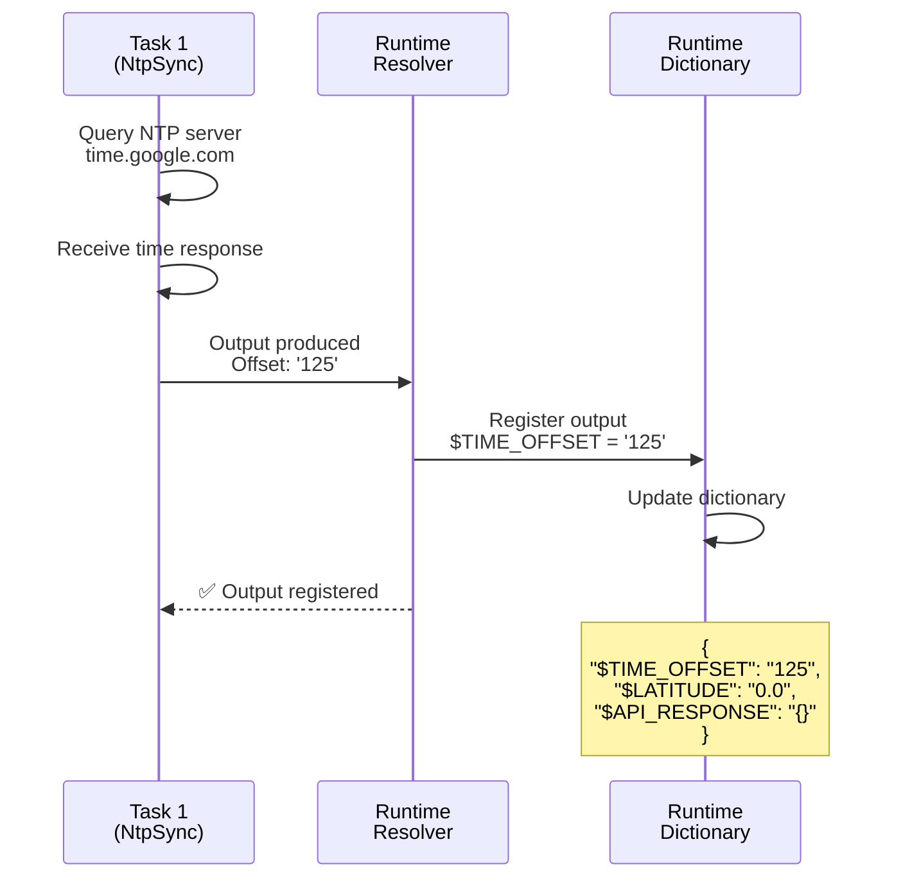

**Dictionary State After Task 1:**
```
{
  "$TIME_OFFSET": "125",
  "$LATITUDE": "0.0",
  "$API_RESPONSE": "{}"
}
```

---

## Stage 3: Parameter Resolution

Before Task 2 executes, the **Runtime Resolver scans all parameters** for variables (strings starting with `$`) and replaces them with dictionary values.

### Example: CompareNumber Task

```json
{
  "CompareNumber": [
    {
      "id": "2",
      "num_x": "$TIME_OFFSET",
      "num_y": "200",
      "compare_type": 2
    }
  ]
}
```

### Resolution Process

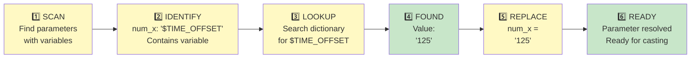

**Before Resolution:**
```json
{
  "num_x": "$TIME_OFFSET",
  "num_y": "200",
  "compare_type": 2
}
```
**Note:** `num_x` contains a variable reference

**After Resolution:**
```json
{
  "num_x": "125",
  "num_y": "200",
  "compare_type": 2
}
```
**Note:** `num_x` now contains the resolved value (still String, casting comes next)

---

## Stage 4: Type Casting

After resolution, values are **cast to the expected parameter type**.

### Casting Types

| From | To | Example | Process |
|------|-----|---------|---------|
| String | String | `"Synchronized"` | No conversion |
| String | Integer | `"125"` | Parse to integer: `125` |
| String | Double | `"25.5"` | Parse to float: `25.5` |
| String | JSON | `'{"status": "ok"}'` | Parse to object: `{status: "ok"}` |
| String | Boolean | `"true"` | Parse to boolean: `true` |

### Casting Example 1: Integer Casting

```json
{
  "CompareNumber": [
    {
      "id": "3",
      "num_x": "$TIME_OFFSET",
      "num_y": "100",
      "compare_type": 1
    }
  ]
}
```

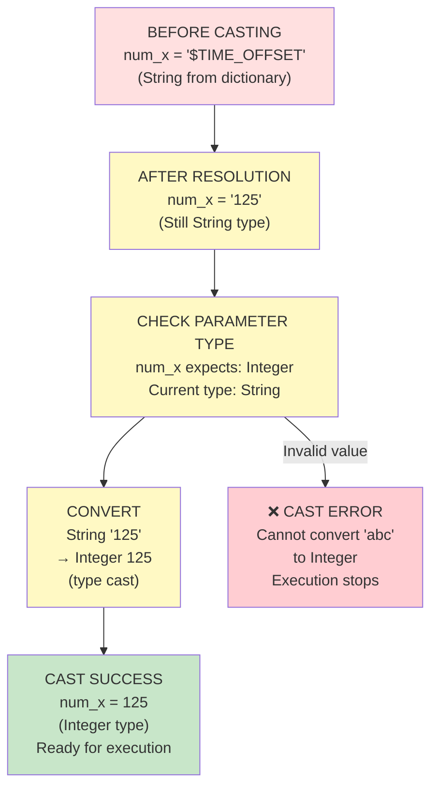

### Casting Example 2: Double Casting

```json
{
  "CompareNumber": [
    {
      "id": "4",
      "num_x": "$LATITUDE",
      "num_y": "50.0",
      "compare_type": 1
    }
  ]
}
```

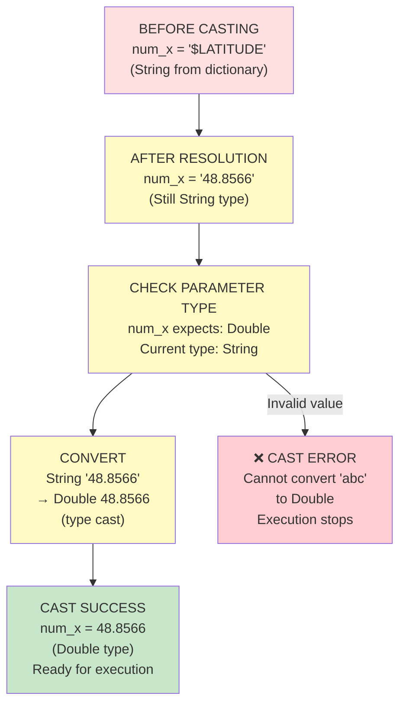

---

## Complete Workflow Execution Example

### Workflow JSON

**Scenario:** Check NTP RTT quality. If RTT > 100ms, retry with different server.

```json
{
  "Start": [
    {
      "id": "0",
      "variables": [
        {"variableName": "$NTP_RTT", "variableValue": "0"},
        {"variableName": "$TIME_OFFSET", "variableValue": "0"}
      ]
    }
  ],
  
  "NtpSync": [
    {
      "id": "1",
      "ntp_server": "time.google.com",
      "ntp_port": 123,
      "ntp_timeout": 5000,
      "ntp_rtt_output": "$NTP_RTT",
      "ntp_offset_output": "$TIME_OFFSET"
    },
    {
      "id": "3",
      "ntp_server": "pool.ntp.org",
      "ntp_port": 123,
      "ntp_timeout": 5000,
      "ntp_rtt_output": "$NTP_RTT",
      "ntp_offset_output": "$TIME_OFFSET"
    }
  ],
  
  "CompareNumber": [
    {
      "id": "2",
      "num_x": "$NTP_RTT",
      "num_y": "100",
      "compare_type": 2
    },
    {
      "id": "4",
      "num_x": "$NTP_RTT",
      "num_y": "100",
      "compare_type": 2
    }
  ],
  
  "TextReport": [
    {
      "id": "5",
      "texte": "NTP sync OK! RTT: $NTP_RTT ms, Offset: $TIME_OFFSET ms"
    },
    {
      "id": "6",
      "texte": "NTP sync failed after retry. RTT: $NTP_RTT ms (too high)"
    }
  ],
  
  "End": [{"id": "100"}],
  
  "Links": [
    {"from": "0", "to": "1"},
    {"from": "1", "to": "2"},
    {"from": "2", "true": "5", "false": "3"},
    {"from": "3", "to": "4"},
    {"from": "4", "true": "5", "false": "6"},
    {"from": "5", "to": "100"},
    {"from": "6", "to": "100"}
  ]
}
```

### Execution Table

| Step | Task | Operation | Dictionary State | Notes |
|------|------|-----------|------------------|-------|
| 1 | START (id:0) | Initialize variables | `{"$NTP_RTT": "0", "$TIME_OFFSET": "0"}` | Initial values |
| 2 | NtpSync (id:1) | Query time.google.com | Same | First attempt |
| 3 | NtpSync (id:1) | Response received | Same | RTT=300ms, Offset=125ms |
| 4 | Runtime Resolver | **Register outputs** | `{"$NTP_RTT": "300", "$TIME_OFFSET": "125"}` | ⚠️ **RTT too high** |
| 5 | CompareNumber (id:2) | Await execution | Same | Will check RTT quality |
| 6 | Runtime Resolver | **Resolve $NTP_RTT** | Same | Scan: `num_x: "$NTP_RTT"` |
| 7 | Runtime Resolver | **Replace & cast** | Same | `num_x = "300" → 300` |
| 8 | CompareNumber (id:2) | Execute: 300 < 100 | Same | Result: **FALSE** |
| 9 | Runtime Resolver | **Branch to Task 3** | Same | RTT not acceptable, retry |
| 10 | NtpSync (id:3) | Query pool.ntp.org | Same | **Retry** with different server |
| 11 | NtpSync (id:3) | Response received | Same | RTT=45ms, Offset=98ms |
| 12 | Runtime Resolver | **Register outputs** | `{"$NTP_RTT": "45", "$TIME_OFFSET": "98"}` | ✅ **RTT acceptable** |
| 13 | CompareNumber (id:4) | Await execution | Same | Check RTT again |
| 14 | Runtime Resolver | **Resolve $NTP_RTT** | Same | Lookup: finds '45' |
| 15 | Runtime Resolver | **Replace & cast** | Same | `num_x = "45" → 45` |
| 16 | CompareNumber (id:4) | Execute: 45 < 100 | Same | Result: **TRUE** ✅ |
| 17 | Runtime Resolver | **Branch to Task 5** | Same | RTT acceptable, success |
| 18 | TextReport (id:5) | Await execution | Same | Prepare success message |
| 19 | Runtime Resolver | **Resolve multi-variables** | Same | `$NTP_RTT → '45'`, `$TIME_OFFSET → '98'` |
| 20 | TextReport (id:5) | Display message | Same | "NTP sync OK! RTT: 45 ms, Offset: 98 ms" |
| 21 | END (id:100) | Workflow complete | `{"$NTP_RTT": "45", "$TIME_OFFSET": "98"}` | Final state persists |

### Visual Execution Timeline

**Real-World Example:** Check NTP RTT (Round Trip Time) before accepting offset. If RTT > 100ms, retry synchronization.

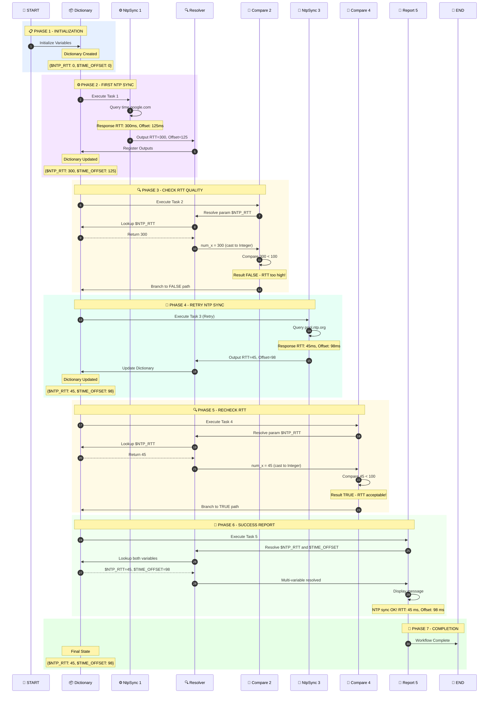

### Dictionary Lifecycle Through Workflow

This example shows how the dictionary evolves:

| Step | Action | Dictionary State | Notes |
|------|--------|------------------|-------|
| 1 | **START** | `{$NTP_RTT: '0', $TIME_OFFSET: '0'}` | Initial values |
| 2 | **NtpSync #1** executes | Same | First query to time.google.com |
| 3 | **Register outputs** | `{$NTP_RTT: '300', $TIME_OFFSET: '125'}` | ⚠️ RTT too high (300ms) |
| 4 | **CompareNumber #2** resolves | Same | Check if 300 < 100 |
| 5 | **CompareNumber #2** result | Same | FALSE → RTT not acceptable |
| 6 | **Branch to retry** | Same | Follow FALSE path |
| 7 | **NtpSync #3** executes | Same | Retry with pool.ntp.org |
| 8 | **Register outputs** | `{$NTP_RTT: '45', $TIME_OFFSET: '98'}` | ✅ RTT acceptable (45ms) |
| 9 | **CompareNumber #4** resolves | Same | Check if 45 < 100 |
| 10 | **CompareNumber #4** result | Same | TRUE → RTT acceptable |
| 11 | **Branch to success** | Same | Follow TRUE path |
| 12 | **TextReport #5** resolves | Same | Multi-variable resolution |
| 13 | **Display message** | Same | Final report |
| 14 | **END** | `{$NTP_RTT: '45', $TIME_OFFSET: '98'}` | Final state persists |


---

## Multi-Variable Resolution

A parameter can contain **multiple variables** that all need resolution:

```json
{
  "TextReport": [
    {
      "id": "5",
      "texte": "NTP Offset: $TIME_OFFSET ms | Location: Latitude $LATITUDE"
    }
  ]
}
```

### Resolution Steps

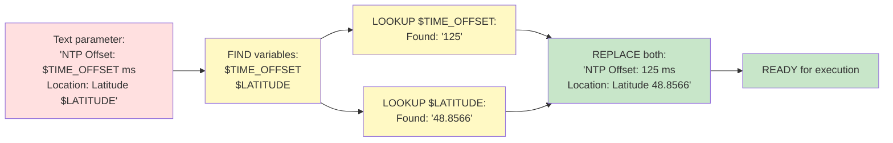

---

## Error Scenarios

### Scenario 1: Undefined Variable

```json
{
  "CompareText": [
    {
      "id": "2",
      "text_x": "$UNDEFINED_VAR",
      "text_y": "test"
    }
  ]
}
```

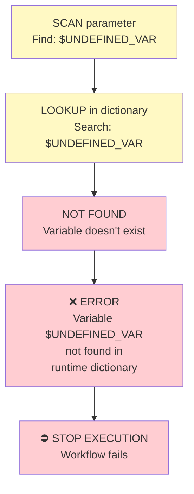

### Scenario 2: Type Casting Error

```json
{
  "CompareNumber": [
    {
      "id": "2",
      "num_x": "$TEXT_VALUE",
      "num_y": "50.0"
    }
  ]
}
```

Dictionary: `{"$TEXT_VALUE": "abc"}` (not a valid number)

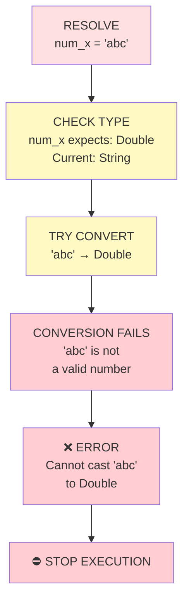

---

## Runtime Dictionary State Machine

The runtime dictionary evolves through the workflow lifecycle:

```mermaid
flowchart TD
    Start["🏁 INITIALIZED<br/>━━━━━━━━━━━━━━<br/>START Node<br/>Dictionary = {}<br/>Variables declared<br/>Initial values set"]
    
    Task1Exec["⚙️ TASK 1 EXECUTES<br/>━━━━━━━━━━━━━━<br/>Task runs<br/>Produces output"]
    
    Task1Done["✅ OUTPUT REGISTERED<br/>━━━━━━━━━━━━━━<br/>Dictionary updated<br/>{$VAR1: 'value1'}"]
    
    Task2Ready["⏳ TASK 2 AWAITS<br/>━━━━━━━━━━━━━━<br/>Resolver scans<br/>parameters"]
    
    Task2Resolve["🔍 RESOLVER RESOLVES<br/>━━━━━━━━━━━━━━<br/>Replaces variables<br/>with values"]
    
    Task2Cast["🔄 RESOLVER CASTS<br/>━━━━━━━━━━━━━━<br/>Types converted<br/>as needed"]
    
    Task2Exec["⚙️ TASK 2 EXECUTES<br/>━━━━━━━━━━━━━━<br/>With resolved<br/>values"]
    
    Task2Done["✅ OUTPUT REGISTERED<br/>━━━━━━━━━━━━━━<br/>Dictionary extends"]
    
    Completed["🎯 COMPLETED<br/>━━━━━━━━━━━━━━<br/>Workflow End<br/>Final dictionary<br/>state persists"]
    
    Start --> Task1Exec
    Task1Exec --> Task1Done
    Task1Done --> Task2Ready
    Task2Ready --> Task2Resolve
    Task2Resolve --> Task2Cast
    Task2Cast --> Task2Exec
    Task2Exec --> Task2Done
    Task2Done --> Completed
    
    style Start fill:#e3f2fd,stroke:#1976d2,stroke-width:3px
    style Task1Exec fill:#f3e5f5,stroke:#7b1fa2,stroke-width:2px
    style Task1Done fill:#c8e6c9,stroke:#388e3c,stroke-width:3px
    style Task2Ready fill:#fff9c4,stroke:#f57c00,stroke-width:2px
    style Task2Resolve fill:#fff9c4,stroke:#f57c00,stroke-width:2px
    style Task2Cast fill:#fff9c4,stroke:#f57c00,stroke-width:2px
    style Task2Exec fill:#f3e5f5,stroke:#7b1fa2,stroke-width:2px
    style Task2Done fill:#c8e6c9,stroke:#388e3c,stroke-width:3px
    style Completed fill:#c8e6c9,stroke:#2e7d32,stroke-width:4px
```

---

## Where to Find Variables in Workflow Runtime

Variables exist in **three key locations** during workflow execution:

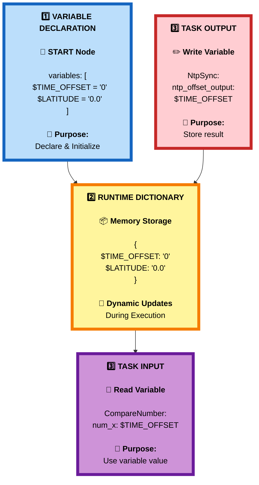

### Variable Lifecycle Example

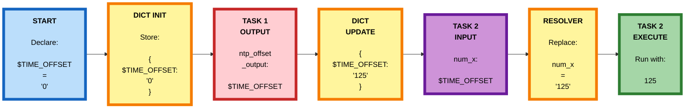

### How to Access Variables in Different Contexts

| Context | How to Find | Example | Purpose |
|---------|-------------|---------|---------|
| **START Node** | Look at `Start[0].variables` array | `{"variableName": "$TIME_OFFSET", "variableValue": "0"}` | Declaration & initialization |
| **Task Output** | Look at task's output parameter fields | `"ntp_offset_output": "$TIME_OFFSET"` | Write task result to variable |
| **Task Input** | Look at task's input parameter fields | `"num_x": "$TIME_OFFSET"` | Read variable value into parameter |
| **Runtime Dictionary** | Internal memory structure (not in JSON) | `{"$TIME_OFFSET": "125"}` | Current variable values |
| **Resolver** | Automatically scans all task parameters | Finds all strings starting with `$` | Resolve variables before execution |

### Quick Reference: Variable Syntax

```json
{
  "Comment": "✅ CORRECT - Variables start with $",
  "Examples": {
    "declaration": {"variableName": "$MY_VAR", "variableValue": "initial"},
    "output": {"cmd_error_output": "$MY_VAR"},
    "input": {"text_x": "$MY_VAR"},
    "multi_var": {"texte": "Error: $VAR1, Code: $VAR2"}
  }
}
```

```json
{
  "Comment": "❌ INCORRECT - Common mistakes",
  "Mistakes": {
    "no_dollar": {"variableName": "MY_VAR"},
    "wrong_case": {"variableName": "$my_var"},
    "undefined": {"text_x": "$UNDEFINED_VAR"}
  }
}
```

---

## Best Practices for Runtime Resolution

### 1. Declare Variables Early

Always declare all variables in START node:

**✅ Good: All variables declared upfront**
```json
{
  "Start": [{"id": "0", "variables": [...]}]
}
```

**❌ Bad: Missing variable declarations**
```json
{
  "CmdStage": [{"id": "1", "cmd_error_output": "$UNDEFINED"}]
}
```

### 2. Use Descriptive Variable Names

**✅ Good: Clear purpose**
```json
{
  "ntp_status_output": "$NTP_STATUS",
  "ntp_offset_output": "$TIME_OFFSET"
}
```

**❌ Bad: Generic names**
```json
{
  "ntp_status_output": "$x",
  "ntp_offset_output": "$var1"
}
```

### 3. Initialize with Correct Types

**✅ Good: Type-appropriate defaults**
```json
[
  {"variableName": "$ERROR_MSG", "variableValue": ""},
  {"variableName": "$LATITUDE", "variableValue": "0.0"},
  {"variableName": "$DATA", "variableValue": "{}"}
]
```

**❌ Bad: Mismatched types**
```json
{
  "variableName": "$LATITUDE",
  "variableValue": "unknown"
}
```

### 4. Verify Type Compatibility

Ensure parameter types match expected casts:

**✅ Good: Compatible types**
- `"num_x": "$TIME_OFFSET"` - String stored, cast to Integer
- `"num_x": "$LATITUDE"` - String stored, cast to Double
- `"texte": "$ERROR_MSG"` - String stays String

**❌ Bad: Type mismatch**
- `"num_x": "$TEXT_VALUE"` - Contains "abc", cannot cast to Integer


